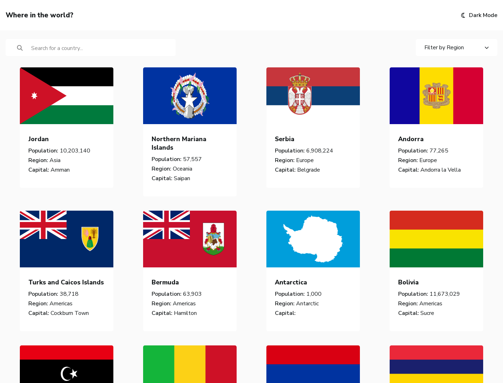

# Frontend Mentor - REST Countries API with color theme switcher solution

This is a solution to the [REST Countries API with color theme switcher challenge on Frontend Mentor](https://www.frontendmentor.io/challenges/rest-countries-api-with-color-theme-switcher-5cacc469fec04111f7b848ca).

## Table of contents

- [Overview](#overview)
  - [The challenge](#the-challenge)
  - [Screenshot](#screenshot)
  - [Links](#links)
- [My process](#my-process)
  - [Built with](#built-with)
- [Author](#author)

## Overview

### The challenge

- See all countries from the API on the homepage
- Search for a country using an `input` field
- Filter countries by region
- Click on a country to see more detailed information on a separate page
- Click through to the border countries on the detail page
- Toggle the color scheme between light and dark mode

### Screenshot

### Links

- Solution URL: [Countries solution](https://www.frontendmentor.io/solutions/response-api-countries-page-with-vue-7i-xUr-RVK)
- Live Site URL: [Countries preview](https://countries-mentor.netlify.app/)

## My process

### Built with

- Vue
- Semantic HTML5 markup
- CSS custom properties
- Flexbox
- Mobile-first workflow
- Tested with Vue Testing Library/Jest

## Author

- Website - [Alexander Guillén Hernández](https://alexanderguillen.netlify.app/)
- Frontend Mentor - [@AlexanderTheWise](https://www.frontendmentor.io/profile/AlexanderTheWise)
- [Linkedin](https://www.linkedin.com/in/alexander-gh)
